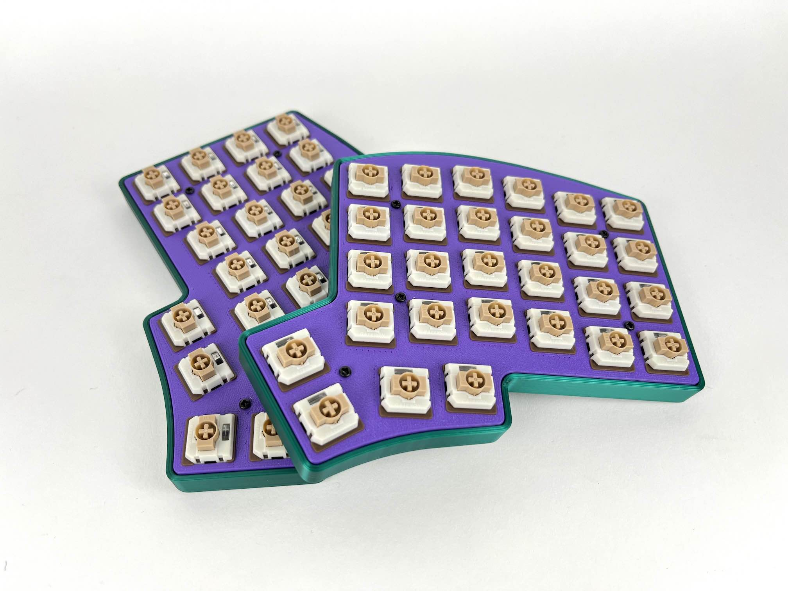
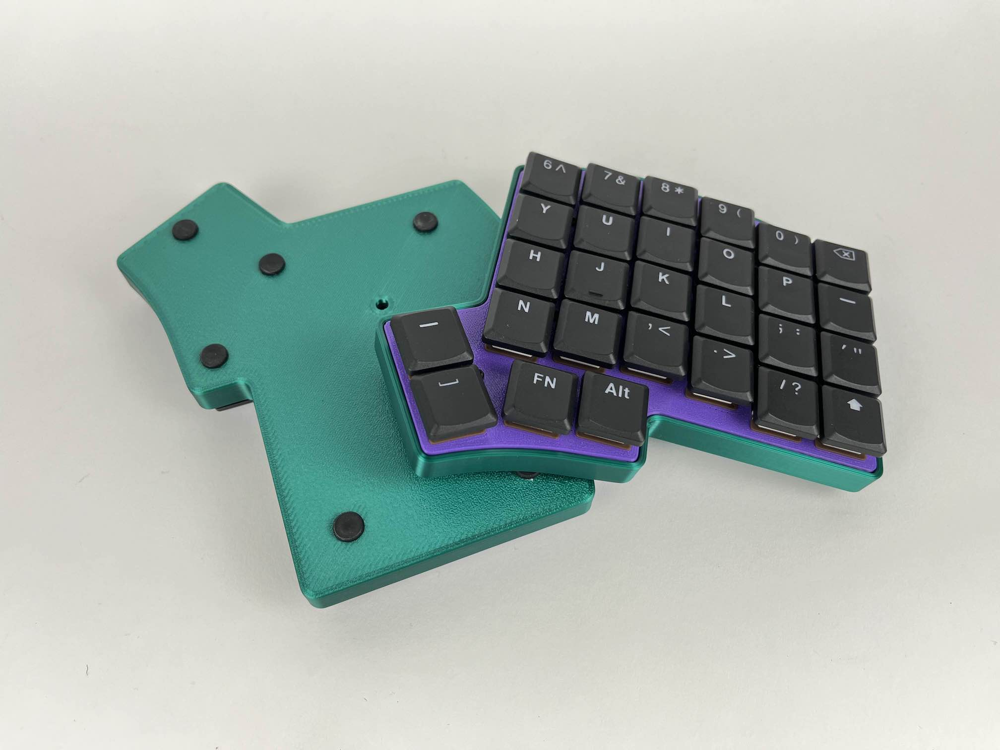

# Iris LM (Low-profile, MX-spaced) Case

Design files for Iris LM case parts

## Files

Files will mainly be provided in a format closely related to the design, so for 2D designs, DXFs will be provided, and not STLs. For STLs, you will need to generate your own from the 2D design files.

- Switch Plate - Designed to be 1.2mm thick so Choc/Gateron LP switches can clip in
- Plate Support - Goes in between PCB and Switch Plate, designed to be 1.0mm thick

### Printable Tray Case

In the [`printable`](printable/) folder, there are STL files for you to print out a case similar to the aluminum case design. The switch plates have been made to be thick enough while also having notches on the underside for the Choc switches to clip into the plate.

In addition to printing the files, you will need the following parts:

- 12x M2 8mm screws ([6mm screws](https://keeb.io/products/m2-screws-and-standoffs?variant=12490111582302) should fine as well)
- [Shroomies Silicone Feet](https://keeb.io/products/shroomies-silicone-feet?utm_source=docs)
- (Optional) [Silicone Tray Liner for the Iris LM](https://keeb.io/products/iris-silicone-tray-liners?variant=41729654521950&utm_source=docs)

This design is not suitable for handwiring, as it's been designed with use of the PCB in-mind.

## Other Info

The silicone feet on the bottom of the tray can be removed. 4 of the holes are arranged in a 50x90mm rectangle and are large enough to accommodate M3 screws being inserted through them. The other two holes are spaced 50mm apart.

## License

These case files are released under the MIT License.
